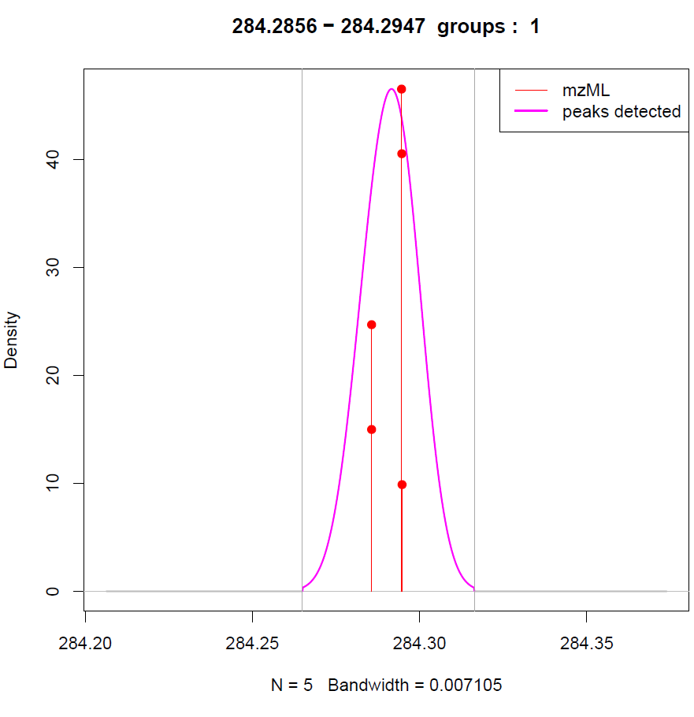
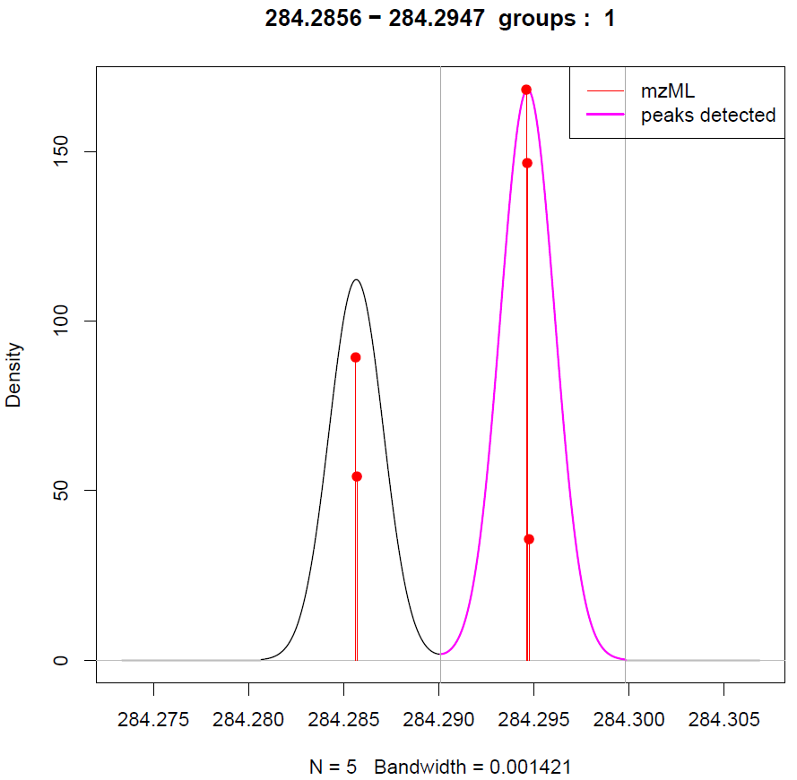
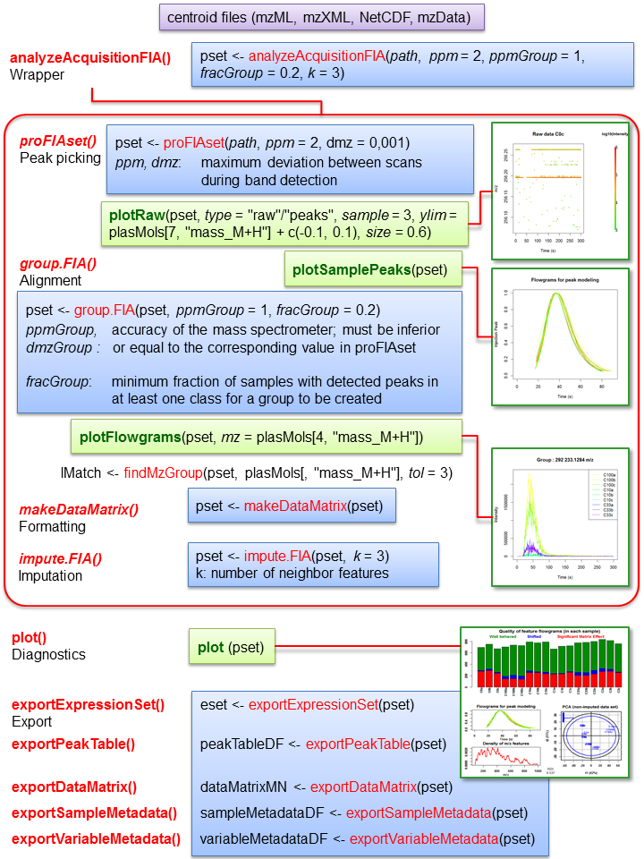

```{r global_options, include=FALSE}
knitr::opts_chunk$set(fig.width=6, fig.height=6, fig.path='figures/')
```

# Context

Flow injection analysis (FIA) is becoming more and more used in the context of
high-throughput profiling, because of an increased resolution of mass
spectrometers (HRMS). The data produced however are complex and affected by
matrix effect which makes their processing difficult. The _**proFIA**_
bioconductor package provides the first workflow to process FIA-HRMS raw data
and generate the peak table. By taking into account the high resolution and the
information of matrix effect available from multiple scans, the algorithms are
robust and provide maximum information about ions m/z and intensitie using the 
full capability of modern mass spectrometers.

# Structure

The first part of this vignette give a quick overview of the _**proFIA**_ main workflow and the second part discuss the important parameters and gives some hint about parameters tuning using the plot offered by _**proFIA**_

# Workflow


The first step generates the `proFIAset` object, which will be further processed
during the workflow. The object contains initial information about the sample
and the classes (when subdirectories for the raw data are present), as well as
all results froom the processing (e.g., detected peaks, grouping, etc.).  At
each step, the data quality can be checked by a graphical overview using the `plot` function. For convenience, the 3 processing functions and methods from the
workflow (`proFIAset`, `group.FIA`, and `impute.FIA`) have been wrapped into
a single `analyzeAcquisitionFIA` function. The final *dataMatrix* can be
exported, as well as the 2 supplementary tables containing the *sampleMetadata*
and the *variableMetadata*.

[proFIA](http://bioconductor.org/packages/proFIA) can also be accessed via a graphical user interface in the **proFIA** module from the [Workflow4Metabolomics.org](http://workflow4metabolomics.org) online resource for computational metabolomics, which provides a user-friendly, **Galaxy**-based environment for data pre-processing, statistical analysis, and annotation [@Giacomoni2015].

# The _**plasFIA**_ data package

A real data set consisting of human plasma spiked with 40 molecules at 3
increasing concentrations was acquired on an Orbitrap mass spectrometer with 2
replicates, in the positive ionization mode (U. Hohenester and C. Junot,
[LEMM laboratory](http://ibitecs.cea.fr/drf/ibitecs/english/Pages/units/spi/lemm.aspx),
CEA, [MetaboHUB](http://www.metabohub.fr/index.php?lang=en&Itemid=473)). The 10
files are available in the _**plasFIA**_ bioconductor data package, in the mzML
format (centroid mode).

# Hands-on

## Peak detection with `proFIAset`

We first load the two packages containing the software and the dataset:
```{r loading, echo=TRUE, warning=FALSE, message=FALSE}
# loading the packages
library(proFIA)
library(plasFIA)
```
```{r paths}
# finding the directory of the raw files
path <- system.file(package="plasFIA", "mzML")
list.files(path)
```
The first step of the workflow is the **proFIAset** function which takes as
input the path to the raw files. This function performs noise model building,
followed by m/z strips detection and filtering. The important parameters to keep
in mind are:

* `noiseEstimation` (logical): shall noise model be constructed to filter
  signal? (recommended).
  
* `ppm` and `dmz` (numeric): maximum deviation between scans during strips detection in ppm. If the deviation in absolute in mz is lower than dmz, *dmz* is taken over *ppm* to account for low masses bias. More information about the tuning of this parameters is given in the [Tuning proFIA parameters](#parameters) section

* `parallel` (logical): shall parallel computation be used. You can define which sort of parallelism you want to use using the [BioCParallel](http://bioconductor.org/packages/release/bioc/html/BiocParallel.html) package.

Note:
As all files need to be processed 2 times, one for noise estimation and one
for model estimation, this step is the most time consuming of the workflow.

```{r profiaset,fig.show="hide",message=FALSE}
# defining the ppm parameter adapted to the Orbitrap Fusion
ppm <- 2

# performing the first step of the workflow
plasSet <- proFIAset(path, ppm=ppm, parallel=FALSE)
```

The quality of peak detection can be assessed by using the `plotRaw` method to 
visualize the corresponding areas in the raw data.

```{r raw_plot}
# loading the spiked molecules data frame
data("plasMols")

# plotting the raw region aroung the Diphenhydramine mass signal
plasMols[7,]
mzrange <- c(plasMols[7,"mass_M+H"]-0.1,plasMols[7,"mass_M+H"]+0.1)
plotRaw(plasSet, type="r", sample=3, ylim=mzrange, size=0.6)
```

In the example above, we see that a signal at 256.195 m/z corresponding to the
solvent has been correctly discarded by _**proFIA**_.

```{r peaks_plot}
# plotting the filter Dipehnhydramine region.
plotRaw(plasSet, type="p", sample=3, ylim=mzrange, size=0.6)
```

Peak detection in _**proFIA**_ is based on matched filtering. It therefore
relies on a peak model which is tuned on the signals from the most intense ions.
The `plotModelFlowgrams` method allows to check visually the consistency of
these reconstructed filters.

```{r plot_injection}
# plotting the injection peak
plotSamplePeaks(plasSet)
```

## Peak grouping with `group.FIA`

The second step of the workflow consists in matching the signals between the
samples. The `group.FIA` methods uses an estimation of the density in the mass
dimension. The two important parameters are:

* `ppmGroup` and `dmzGroup` (numeric): accuracy of the mass spectrometer; must be inferior or equal
to the corresponding value in `proFIAset`

* `fracGroup` (numeric): minimum fraction of samples with detected peaks in at
least one class for a group to be created.
  
```{r group,message=FALSE}
# selecting the parameters
ppmgroup <- 1

# due to the experimental design, sample fraction was set to 0.2
fracGroup <- 0.2

# grouping
plasSet <- group.FIA(plasSet, ppmGroup=ppmgroup, fracGroup=fracGroup)
```
Some help on the tuning of these parameters may be found in the [Tuning proFIA parameters](#parameters) section. The groups may be visualized using the **plotFlowgrams** function, which take as input a mass and a ppm tolerance, or an index.		

```{r plotEICs}
#plotting the EICs of the parameters.		
plotFlowgrams(plasSet,mz=plasMols[4,"mass_M+H"])
```

At this stage, it is possible to check whether a molecule (i.e., a group) has
been detected in the dataset by using the `findMzGroup` method.

```{r find_group}
# Searching for match group with 2 ppm tolerance
lMatch <- findMzGroup(plasSet,plasMols[,"mass_M+H"],tol=3)

# index of the 40 molecules which may be used with plotEICs
molFound <- data.frame(names=plasMols[,"names"],found=lMatch)
head(molFound)

#Getting the molecules which are not detected
plasMols[which(is.na(lMatch)),]
```
We see that molecules 5 and 16 were not found, which is coherent with their
chemical classes as they are both Dicarboxylic Acids, which ionizes in negative modes.

## Peak table with `makeDataMatrix`

The data matrix (*peak table*) can be built with the `makeDataMatrix` method:
ion intensities can be computed either as the areas of the peaks (`maxo=F`)
which is considered to be more robust, or as the maximum intensities
(`maxo=T`).

```{r datamatrix}
# building the data matrix
plasSet <- makeDataMatrix(plasSet, maxo=FALSE)
```

## Imputation`impute.FIA`
Two methods are currently implemented in the package which were described as the top performing methods in [@Dunn2017], random forest and k-Nearest Neighbour for truncated ditribution. The method may be chosen using the _method_ argument of *impute.FIA* function. If you use k-NN the _k_ arguments should at least be supplied. _k_ may be a float inferior to 1 which correspond to the fraction of each class used for imputation, or an integer greater than 3 in this case _k_ will be the same for all classes.
```{r impute_fia, warning=FALSE, eval=FALSE}
# k is supposed to be 3 at minimum, however here we have only 2 sample by class, the results of the imputation are therefore irrelevant.
k <- 3

#Missing values  imputation using kNN for truncated distribution by default.
plasSet <- impute.FIA(plasSet,k=k)

#Reinitializing the data matrix.
plasSet <- makeDataMatrix(plasSet)

#Imputation using random forest.
plasSet <- impute.FIA(plasSet,method="randomForest")

#As the dataset is ill-suited for missing value imputation we rebuild the data matrix.
plasSet <- makeDataMatrix(plasSet)
```
If you want to try the other imputation method, the data matrix shall be reset using the _makeDataMatrix_ function.

## Quality evaluation with `plot`

Plot allows you yo obtain a quick overview of the data, by plotting a summary of the acquisition :
```{r plot,message=FALSE}
plot(plasSet)
```
Note that all the graph are not all present at each step of the workflow. A small discussion of the content of each graph is given there :

* *Number of peaks* The upper graph show the number of relevant signal found in each sample, and labels the peaks in three cathegories. Peaks shifted in time correspond to peak which are outside the detected sample peak, and are probably results of rentention in the windows. Peak sufferient from shape distrosion are often affected by an heavy matrix effect, these 2 cathegories may indicate an issue in the acquisition. Well-behaved peak correspond to peak which follow the sample injection peak. For proFIA to perform optimally, the majority of these peak should be in this cathegory.

* *Injection Peaks* This give an overview of all the samples injections peaks regressed by proFIA, if the Flow Injection condition are the same, they should have similar shapes.

* *Density of m/z of found features* This plot is present after the goruping phase. It represent the density of the found features. This plot may allows the spotting of a missed band detection, resulting in no group at the end of the range of m/z, which can be caused by a wrong setting of the *dmz* or *ppm* parameters.

* *PCA* This graph is present after the data matrix construction. A simple ACP of the log intensity, allows you to quickly spot aberrant value in one acquisition. It is good to note that the plot is different after missing value imputation, as the data matrix changed.


## Running the whole workflow with `analyzeAcquisitionFIA`

The whole workflow described previously can be run by a single call to the 
*analyzeAcquisitionFIA* function:
```{r analyzeAcquisitionFIA, eval=FALSE}
#selecting the parameters
ppm <- 2
ppmgroup <- 1
fracGroup <- 0.2
k <- 3

# running the whole workflow in a single step
plasSet <- analyzeAcquisitionFIA(path, ppm=ppm, ppmGroup=ppmgroup, k=k,fracGroup = fracGroup,parallel=FALSE)

# Running the wholoe workflow in a single step, using parallelism
# with the BiocParallel package
plasSet <- analyzeAcquisitionFIA(path, ppm=ppm, ppmGroup=ppmgroup, k=k,fracGroup = fracGroup,parallel=TRUE)

```

## Export

The processed data can be exported either as:

+ A peak table in a format similar to the XCMS output.

+ An *ExpressionSet* object (see the
[Biobase](http://bioconductor.org/packages/release/bioc/html/Biobase.html)
bioconductor package).

+ A peak table which may be created using the *exportPeakTable* function.

+ 3 .tsv tabular files corresponding to the *dataMatrix*, the
*sampleMetadata*, and the *variableMetadata*, and which are compatible with the
[Workflow4metabolomics](http://workflow4metabolomics.org) format.

```{r export}
#Expression Set.
eset <- exportExpressionSet(plasSet)
eset

#Peak Table.
pt <- exportPeakTable(plasSet)

#3 Tables:
dm <- exportDataMatrix(plasSet)
vm <- exportVariableMetadata(plasSet)
```

## Examples of downstream statistical analyzes

Univariate and multivariate analyzes can be applied to the processed peak
table. As an example, we perform  a modeling of the spiking dilution
with Orthogonal Partial Least Squares, by using the
[ropls](http://bioconductor.org/packages/release/bioc/html/ropls.html)
bioconductor package. This allows us to illustrate the efficiency of the
matrix effect indicator.

```{r multivariate}
library(ropls)

data("plasSamples")
vconcentration <- plasSamples[,"concentration_ng_ml"]
#vconcentration=(c(100,100,1000,1000,10000,10000)*10^-10)
peakTable <- exportPeakTable(plasSet,mval="zero")

###Cutting the useless column
dataMatrix <- peakTable[,1:nrow(phenoClasses(plasSet))]
```

```{r plot_summary_opls, echo=FALSE}
plasSet.opls <- opls(t(dataMatrix),log10(vconcentration),predI = 1,log10L = TRUE, orthoI = NA, devNewL = FALSE,crossvalI=5)
```
```{r plot_summary_opls_h, eval=FALSE}
plasSet.opls <- opls(t(peakTable),scale(log10(vconcentration)),predI = 1,log10L = TRUE, orthoI = NA)
```
As the variance explained Q2 is superior to 0.9, the fitted model explains the majority of the variance. The score plot and the observation diagnostic show that there as no aberrant deviation between samples. As the compounds are spiked with an increasing concentration of chemicals, this should be visible of the first components. We see that the non suppressed peak contribute the most to the data.
```{r matrix_effect_plot}
matEfInd <- peakTable$corSampPeakMean
nnaVl <- !is.na(matEfInd)
matEfInd <- matEfInd[nnaVl]
ordVi <- order(matEfInd)
matEfInd <- matEfInd[ordVi]
vipVn <- getVipVn(plasSet.opls)[nnaVl]
orthoVipVn <- getVipVn(plasSet.opls, orthoL = TRUE)[nnaVl]
colVc <- rev(rainbow(sum(nnaVl), end = 4/6))
plot(vipVn[ordVi], orthoVipVn[ordVi], pch = 16, col = colVc,
     xlab = "VIP", ylab = "VIP_ortho", main = "VIP_ortho vs VIP.",lwd=3)

##Adding the point corresponding to samples.
points(getVipVn(plasSet.opls)[lMatch],getVipVn(plasSet.opls, orthoL = TRUE)[lMatch], cex=1.2,pch=1,col="black",lwd=2)
legend("topright", legend = c(round(rev(range(matEfInd)), 2),"Spiked molecules."), pch=c(16,16,1),col = c(rev(colVc[c(1, length(colVc))]),1))
```
The two clusters are probably caused by molecules naturally present in the plasma and molecules not present in the plasma.


#Tuning *proFIA* parameters {#parameters}
This vignette aims to help the tuning of the parameters of the proFIA workflow, and show how to use the plot functions and the diagnostic function to help the utning of the parameters. The more important parameters are the parameters of the peak picking function, *findFIASignal*, which will be discussed in more detail here.

##proFIAset
Peak picking is the critical step for FIA-HRMS preprocessing. It is performed within each file independently by an internal call to the *findFIASignal* function. The parameters, in particular ppm and dmz, should be tuned according to the instrument (e.g., mass resolution) and analytical protocol used.

###Main parameters: ppm and dmz
* _ppm_ and _dmz_
The detection of bands corresponding to the same m/z signal in the time dimension is/ pivotal for successful peak detection. The method relies on two important parameters: _ppm_ and _dmz_. _ppm_ defines the tolerance between two points belonging to the same ion into two in consecutives successive scans in ppm. At low m/z, however, the accuracy of mass spectrometers is known to decrease, meaning that the tolerance defined by _ppm_ would be too stringent. A minimum threshold for the m/z deviation tolerance, _dmz_ (in Dalton), therefore needs to be specified (at each m/z, the tolerance used by the algorithm will be the minimum between the value defined by _ppm_, and _dmz_).Both ppm and dmz parameters are related to the mass resolution of the instrument. As proFIA focuses on high resolution data, _ppm_ should be less than 15. Our experience of the application of proFIA to three datasets from LTQ Orbitrap XL (mass resolution: 60K), Exactive (100K) and Fusion (500K) Orbitrap instruments resulted in _ppm_ values set to 8, 8, and 2, respectively. The default value of _dmz_ is 0.001. This value was set to 0.0005 for the data set obtained at a 500K resolution with the Orbitrap Fusion.

The influence of ppm and dmz on band detection can be visualized by *plotRaw*. 
```{r plotRaw_exemple_1, message = FALSE,warning=FALSE, results='hide'}
##Loading the plasFIA dataset
library(plasFIA)
library(proFIA)

data(plasSet)

###Selection of the first sample file
filepath <- phenoClasses(plasSet)[1,1]
filepath

###Loading the raw data
xraw <- xcmsRaw(filepath)

#proFIAset relies on the internal findBandsFIA function to detect m/z bands. The influence of ppm and dmz values can be visualized as follows:
band_list <- findBandsFIA(xraw, ppm = 15, dmz = 0.001)
mzlim <- c(233.067,233.082)
plotRaw(plasSet,sample=2,ylim=mzlim,type="r",legend=FALSE)
abline(h=band_list[,c("mzmin","mzmax")],lwd=0.5,lty=2,col="purple")
```
Here we see that two distinct bands have been mistakenly grouped by the algorithm because the ppm value was too high. Decreasing the ppm value leads to the correct detection of the two bands:

```{r plotRaw_exemple_2, message = FALSE,warning=FALSE, results='hide'}
band_list <- findBandsFIA(xraw, ppm = 2, dmz = 0.0005)
plotRaw(plasSet,sample=2,ylim=mzlim,type="r",legend=FALSE)
abline(h=band_list[,c("mzmin","mzmax")],lwd=0.5,lty=2,col="purple")
```
Note: Too low _dmz_ values result in the absence of detected signals at low m/z, which can be checked on the “density of m/z features” graphic generated by the *plot* function

[//]: # (Add Noise parameters)

###Supplementary parameters

* _bandCoverage_ and _sizeMin_
A band is kept only if there is at least _bandCoverage_ fraction of point centroids in the injection window, or if there is at least _sizeMin_ consecutives points. The _bandCoverage_ default value of 0.3 is adapted but may need to be increased in the presence of a long right-tailed peak originating from diffusion in the carrier flow, especially if the number of detected signals seems too high or too low. A lower values allows a better sensitivity, at the detriment of the reproductibility of peak picking.

* _pvalthresh_
The pval thresh parameter is only used in case where a peak is detected with a baseline. This should not happen except if you have strong carry over between the acquisition. For example in *plasSet* dataset, a p-value is calculated on only 22 variables out of 834. The parameter value is set to 0.01 by default and, but may be tune down (to 0.001 by example) in case of noisy data with strong carry-over effect.

* Situationnal parameters
    These parameters should not be used in the general case, but they can be used to treat particular acquisition, which ill formed peaks or other issue
    + _scanMin_ and _scanMax_ The bands and peak will only be detected in the (_scanMin_,_scanMax_) range. This is useful if you have chemical noise at the beginning or at the end of your injection.
    + _f_ The standard method is  'regression' on the most well-shaped peak , which uses the Total Injection flowgram (TIF) to define the starting values. In cases were the TIC is wrongly conditioned, this method may fail, in this case you may set f to ‘TIC’ which won’t perform the regression and directly use the TIC peak as a filter. The obtained peak will be affected by matrix effect.

The remaining arguments do not impact the detection, and are only used for intensity measurement (please see the documentation page of *findFIASignal* for their details).

##group.FIA
The grouping step match the signal with similar m/z between different samples. It takes two parameters:

* _ppmGroup_ and _dmzGroup_
They are similar in defintion to the _ppm_ and _dmz_ parameter used in the *proFIAset* function, except that they determine the bandwidth of the density taken as a parameter. As the measured mz considering for grouping are the mz of peaks, and not the m/z of individual data points, it is more accurate, we recommend to fix it to at most $ppm/2$. As described in *proFIAset* parameters settings, a tolerance in ppm is not adapted to lower m/z values so the bandwidth is taken as the minimum of the 2 tolerances. The efficiency of the grouping may be adapted using the sleep parameters to check if groups are correctly split, here is an example using two value of _ppmGroup_ and _dmzGroup_
```{r group_good_value, message=FALSE, results="hide", eval=FALSE}
plasSet <- group.FIA(plasSet,ppmGroup=5,dmzGroup=0.001,fracGroup=3/18,sleep=0.001)
```

Here two distincts groups are clearly visibly and have been wrongly group. We therefore may reduce the _ppm_ and _dmz_ parameters : 
```{r group_wrong_value, message=FALSE, results="hide",eval=FALSE}
plasSet <- group.FIA(plasSet,ppmGroup=1,dmz=0.001,fracGroup=3/18,sleep=0.001)
```


This set of parameters leads to a correct splitting of the two groups.

* _fracGroup_
The _fracGroup_ parameter determines in which fraction of any class a signal needs to be found to be considered as valid. It depends of your experimental setup, if your classes are homogeneous the standard value of 0.5 is a good value, this parameter may be reduced for a better sensibility.

##makeDataMatrix
The *makeDataMatrix* function just create the data matrix which will be used and exported. The only important parameters is _maxo_ which is set to FALSE by default. If _maxo_ is FALSE then the intensity considered for the exportation and the missing values imputation is the area integrated by proFIA, if it is set to TRUE, the maximum intensity of the chromatograms. As data in FIA are often noisy, we recommend to keep it to FALSE to reduce the uncertainity of measurements.

##Imputation
proFIA offer two imputations method grouped in the *impute.FIA*, which may be accessed by setting the _method_ parameter to 'KNN_TN' or 'randomForest'. *impute.KNN\_TN* and *impute.randomForest* : 

* _KNN\_TN_ : A k-NN imputation using truncated distribution estimation.
    + _k_ correspond to the number of neighbour. It can be a float indicating a fraction of each class.
    + _classes_ how to handle imputation for different classes, if set to 'split', the classes are taken separately, if 'unique', the imputation is done on the full data matrix.'split' is the default option and the recommended option.
    
* _randomForest_ : A random forest imputation, the parameters are passed to the *missForest* function in the missForest package, the interested readers in invited to read the function documentation for parameters description.

As proFIA does not offer statistical modeling, it is hard to evaluate the effect of missing values imputations using only proFIA. However the *plot* method of the proFIAset object, allows you to see in the bottom right corner an PCA before imputation and after imputation. In this case as there is only 3 samples by class the dataset is not suited for missing value imputation, the following code is only there for demonstration purpose :

```{r missing_values_1}
data(plasSet)

###You can reset the data matrix this way
plasSet <- makeDataMatrix(plasSet)

###Before imputation.
plot(plasSet)
```

And then after imputation :
```{r missing_values_2}
plasSet <- impute.randomForest(plasSet)

###After imputation.
plot(plasSet)
```
More information on the parameters may be found in the documentation. It shall be noted that the peak picking step is the longest, so picking a small subset of data and testing various parameters, then plotting the obtained information using _plot_ methods and the _plotRaw_ function shloud help you to select the parameters before launching a a workflow on your full dataset.

# Cheat Sheet
A pdf version of this cheat sheet is available in the *proFIA* directory :
```{r cheat_sheet}
system.file(package="proFIA")
```



# Session info

Here is the output of `sessionInfo()` on the system on which this document was
compiled:

```{r sessionInfo, echo=FALSE}
sessionInfo()
```
