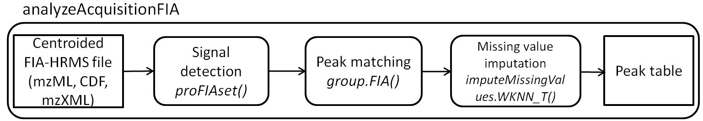

```{r global_options, include=FALSE}
knitr::opts_chunk$set(fig.width=6, fig.height=6, fig.path='figures/')
```

# Context

Flow injection analysis (FIA) is becoming more and more used in the context of
high-throughput profiling, because of an increased resolution of mass
spectrometers (HRMS). The data produced however are complex and affected by
matrix effect which makes their processing difficult. The _**proFIA**_
bioconductor package provides the first workflow to process FIA-HRMS raw data
and generate the peak table. By taking into account the high resolution and the
information of matrix effect available from multiple scans, the algorithms are
robust and provide maximum information about ions m/z and intensitie using the 
full capability of modern mass spectrometers.

# Workflow



The first step generates the `proFIAset` object, which will be further processed
during the workflow. The object contains initial information about the sample
and the classes (when subdirectories for the raw data are present), as well as
all results froom the processing (e.g., detected peaks, grouping, etc.).  At
each step, the data quality can be checked by a grphical overview using the `plot` function. For convenience, the 3 processing functions and methods from the
workflow (`proFIAset`, `group.FIA`, and `imputeMissingValues.WKNN_T`) have been wrapped into
a single `analyzeAcquisitionFIA` function. The final *dataMatrix* can be
exported, as well as the 2 supplementary tables containing the *sampleMetadata*
and the *variableMetadata*.

Note that the 3 exported '.tsv' files can be directly used in the Galaxy-based
[Workflow4metabolomics](http://workflow4metabolomics.org) infrastructure for
subsequent statistical analysis and annotation [@Giacomoni2015].

# The _**plasFIA**_ data package

A real data set consisting of human plasma spiked with 40 molecules at 3
increasing concentrations was acquired on an Orbitrap mass spectrometer with 2
replicates, in the positive ionization mode (U. Hohenester and C. Junot,
[LEMM laboratory](http://ibitecs.cea.fr/drf/ibitecs/english/Pages/units/spi/lemm.aspx),
CEA, [MetaboHUB](http://www.metabohub.fr/index.php?lang=en&Itemid=473)). The 10
files are available in the _**plasFIA**_ bioconductor data package, in the mzML
format (centroid mode).

# Hands-on

## Peak detection with `proFIAset`

We first load the two packages containing the software and the dataset:
```{r loading, echo=TRUE, warning=FALSE, message=FALSE}
# loading the packages
library(proFIA)
library(plasFIA)
```
```{r paths}
# finding the directory of the raw files
path <- system.file(package="plasFIA", "mzML")
list.files(path)
```
The first step of the workflow is the **proFIAset** function which takes as
input the path to the raw files. This function performs noise model building,
followed by m/z strips detection and filtering. The important parameters to keep
in mind are:

* `noiseEstimation` (logical): shall noise model be constructed to filter
  signal? (recommended).
  
* `ppm` and `dmz` (numeric): maximum deviation between scans during strips detection in ppm. If the deviation in absolute in mz is lower than dmz, *dmz* is taken over *ppm* to account for low masses bias.

* `parallel` (logical): shall parallel computation be used.

Note:
1. As all files need to be processed 2 times, one for noise estimation and one
for model estimation, this step is the most time consuming of the workflow.
2. The `ppm` parameter is the most important of the workflow; the package was
designed to work optimally for high-resolution data with an accuracy inferior or
equal to 5 ppm.

```{r profiaset,fig.show="hide",message=FALSE}
# defining the ppm parameter adapted to the Orbitrap Fusion
ppm <- 2

# performing the first step of the workflow
plasSet <- proFIAset(path, ppm=ppm, parallel=FALSE)
```

The quality of peak detection can be assessed by using the `plotRaw` method to 
visualize the corresponding areas in the raw data.

```{r raw_plot}
# loading the spiked molecules data frame
data("plasMols")

# plotting the raw region aroung the Diphenhydramine mass signal
plasMols[7,]
mzrange <- c(plasMols[7,"mass_M+H"]-0.1,plasMols[7,"mass_M+H"]+0.1)
plotRaw(plasSet, type="r", sample=3, ylim=mzrange, size=0.6)
```

In the example above, we see that a signal at 256.195 m/z corresponding to the
solvent has been correctly discarded by _**proFIA**_.

```{r peaks_plot}
# plotting the filter Dipehnhydramine region.
plotRaw(plasSet, type="p", sample=3, ylim=mzrange, size=0.6)
```

Peak detection in _**proFIA**_ is based on matched filtering. It therefore
relies on a peak model which is tuned on the signals from the most intense ions.
The `plotModelFlowgrams` method allows to check visually the consistency of
these reconstructed filters.

```{r plot_injection}
# plotting the injection peak
plotSamplePeaks(plasSet)
```

## Peak grouping with `group.FIA`

The second step of the workflow consists in matching the signals between the
samples. The `group.FIA` methods uses an estimation of the density in the mass
dimension. The two important parameters are:

* `ppmGroup` (numeric): accuracy of the mass spectrometer; must be inferior or equal
to the corresponding value in `proFIAset`,

* `fracGroup` (numeric): minimum fraction of samples with detected peaks in at
least one class for a group to be created.
  
```{r group,message=FALSE}
# selecting the parameters
ppmgroup <- 1

# due to the experimental design, sample fraction was set to 0.2
fracGroup <- 0.2

# grouping
plasSet <- group.FIA(plasSet, ppmGroup=ppmgroup, fracGroup=fracGroup)
```

The groups may be visualized using the **plotFlowgrams** function, which take as input a mass and a ppm tolerance, or an index.		

```{r plotEICs}
#plotting the EICs of the parameters.		
plotFlowgrams(plasSet,mz=plasMols[4,"mass_M+H"])
```

At this stage, it is possible to check whether a molecule (i.e., a group) has
been detected in the dataset by using the `findMzGroup` method.

```{r find_group}
# Searching for match group with 2 ppm tolerance
lMatch <- findMzGroup(plasSet,plasMols[,"mass_M+H"],tol=3)

# index of the 40 molecules which may be used with plotEICs
molFound <- data.frame(names=plasMols[,"names"],found=lMatch)
head(molFound)

#Getting the molecules which are not detected
plasMols[which(is.na(lMatch)),]
```
We see that molecules 5 and 16 were not found, which is coherent with their
chemical classes as they are both Dicarboxylic Acids, which ionizes in negative modes.

## Peak table with `makeDataMatrix`

The data matrix (*peak table*) can be built with the `makeDataMatrix` method:
ion intensities can be computed either as the areas of the peaks (`maxo=F`)
which is considered to be more robust, or as the maximum intensities
(`maxo=T`).

```{r datamatrix}
# building the data matrix
plasSet <- makeDataMatrix(plasSet, maxo=FALSE)
```

## Imputation with `imputeMissingValues.WKNN_T`

Imputation of the data matrix is performed by using a weighted k-nearest
neighbours approach. A good number for k is half the size of the smaller class.
* *k* (numeric): number of neighbours

```{r fillpeaks, warning=FALSE, eval=FALSE}
# k is supposed to be 3 at minimum, however here we have only 2 sample by class, the results of the imputation are irrelevant.
k <- 3

#Missing values  imputation
plasSet <- imputeMissingValues.WKNN_TN(plasSet, k=k)

#Because of the too high k, we reinitialize the data matrix.
plasSet <- makeDataMatrix(plasSet)
```
It is good to note that *k* should be greater than 2 because the K-Nearest Neighbour algorithm for truncated distribution is based on correlation for measuring the similarity. As there is 2 replicates in each sample in this case k should have been set to 1, we fix *k* to 3 for demonstration purpose.

## Quality evaluation with `plot`

Plot allows you yo obtain a quick overview of the data, by plotting a summary of the acquisition :
```{r plot,message=FALSE}
plot(plasSet)
```
Note that all the graph are not all present at each step of the workflow. A small discussion of the content of each graph is given there :

* *Number of peaks* The upper graph show the number of relevant signal found in each sample, and labels the peaks in three cathegories. Peaks shifted in time correspond to peak which are outside the detected sample peak, and are probably results of rentention in the windows. Peak sufferient from shape distrosion are often affected by an heavy matrix effect, these 2 cathegories may indicate an issue in the acquisition. Well-behaved peak correspond to peak which follow the sample injection peak. For proFIA to perform optimally, the majority of these peak shloud be in this cathegory.

* *Injection Peaks* This give an overview of all the smaples injections peaks regressed by proFIA, if the Flow Injection condition are the same, they should have close shapes.

* *Density of m/z of found features* This plot is present after the goruping phase. The density of the found features. This plot may allows the spotting of a missed band detection, resulting in no group at the end of the range of m/z, which can be caused by a wrong *dmz* or *ppm* parmeter.

* *PCA* This graph is present after the data matrix construvtion. A simple ACP of the log intensity, allows you to quickly spot abherrant value in one acquisition.


## Running the whole workflow with `analyzeAcquisitionFIA`

The whole workflow described previously can be run by a single call to the 
*analyzeAcquisitionFIA* function:

```{r analyzeAcquisitionFIA, eval=FALSE}
#selecting the parameters
ppm <- 2
ppmgroup <- 1
fracGroup <- 0.2
k <- 3

# running the whole workflow in a single step
plasSet <- analyzeAcquisitionFIA(path, ppm=ppm, ppmGroup=ppmgroup, k=k,fracGroup = fracGroup,parallel=FALSE)

# Running the wholoe workflow in a single step, using parallelism
# with the BiocParallel package
plasSet <- analyzeAcquisitionFIA(path, ppm=ppm, ppmGroup=ppmgroup, k=k,fracGroup = fracGroup,parallel=TRUE)

```

## Export

The processed data can be exported either as:

+ A peak table in a format similar to the XCMS output.

+ An *ExpressionSet* object (see the
[Biobase](http://bioconductor.org/packages/release/bioc/html/Biobase.html)
bioconductor package).

+ A peak table which may be created using the *exportPeakTable* function.

+ 3 .tsv tabular files corresponding to the *dataMatrix*, the
*sampleMetadata*, and the *variableMetadata*, and which are compatible with the
[Workflow4metabolomics](http://workflow4metabolomics.org) format.

```{r export}
#Expression Set.
eset <- exportExpressionSet(plasSet)
eset

#Peak Table.
pt <- exportPeakTable(plasSet)


#3 Tables:
dm <- exportDataMatrix(plasSet)
vm <- exportVariableMetadata(plasSet)
```

## Examples of downstream statistical analyzes

Univariate and multivariate analyzes can be applied to the processed peak
table. As an example, we perform  a modeling of the spiking dilution
with Orthogonal Partial Least Squares, by using the
[ropls](http://bioconductor.org/packages/release/bioc/html/ropls.html)
bioconductor package. This allows us to illustrate the efficiency of the
matrix effect indicator.

```{r multivariate}
library(ropls)

data("plasSamples")
vconcentration <- plasSamples[,"concentration_ng_ml"]
#vconcentration=(c(100,100,1000,1000,10000,10000)*10^-10)
peakTable <- exportPeakTable(plasSet,mval="zero")

###Cutting the useless column
dataMatrix <- peakTable[,1:nrow(phenoClasses(plasSet))]
```

```{r plot_summary_opls, echo=FALSE}
plasSet.opls <- opls(t(dataMatrix),log10(vconcentration),predI = 1,log10L = TRUE, orthoI = NA, devNewL = FALSE,crossvalI=5)
```
```{r plot_summary_opls_h, eval=FALSE}
plasSet.opls <- opls(t(peakTable),scale(log10(vconcentration)),predI = NA,log10L = TRUE, orthoI = NA)
```
As the variance explained Q2 is close to 0.8, so the fitted model explains the majority of the variance. The score plot and the observation diagnostic show that there as no aberrant deviation between samples. As the compounds are spiked with an increasing concentration of chemicals, this should be visible of the first components. The second effect affecting the experiment is the matrix effect. We expect the second compoennts of the model to represent suppressed peaks. We can easely see this by checking the VIP on the main components versus vip on the orthogonal component :
```{r matrix_effect_plot}
matEfInd <- peakTable$corSampPeakMean
nnaVl <- !is.na(matEfInd)
matEfInd <- matEfInd[nnaVl]
ordVi <- order(matEfInd)
matEfInd <- matEfInd[ordVi]
vipVn <- getVipVn(plasSet.opls)[nnaVl]
orthoVipVn <- getVipVn(plasSet.opls, orthoL = TRUE)[nnaVl]
colVc <- rev(rainbow(sum(nnaVl), end = 4/6))
plot(vipVn[ordVi], orthoVipVn[ordVi], pch = 16, col = colVc,
     xlab = "VIP", ylab = "VIP_ortho", main = "VIP_ortho vs VIP.",lwd=3)

##Adding the point corresponding to samples.
points(getVipVn(plasSet.opls)[lMatch],getVipVn(plasSet.opls, orthoL = TRUE)[lMatch], cex=1.2,pch=1,col="black",lwd=2)
legend("topright", legend = c(round(rev(range(matEfInd)), 2),"Spiked molecules."), pch=c(16,16,1),col = c(rev(colVc[c(1, length(colVc))]),1))
```
We see that the VIP of the first component are high when matrix effect is reduced and especially high for spiked molecules. The second axes seems to represent matrix effect. This illustrate the capacity of proFIA to extract interesting signal from raw data and to provides usefull visualisation to assess the quality of the data. The two clusters are probably caused by molecules naturally present in the plasma and molecules not present in the plasma.


# Session info

Here is the output of `sessionInfo()` on the system on which this document was
compiled:

```{r sessionInfo, echo=FALSE}
sessionInfo()
```
